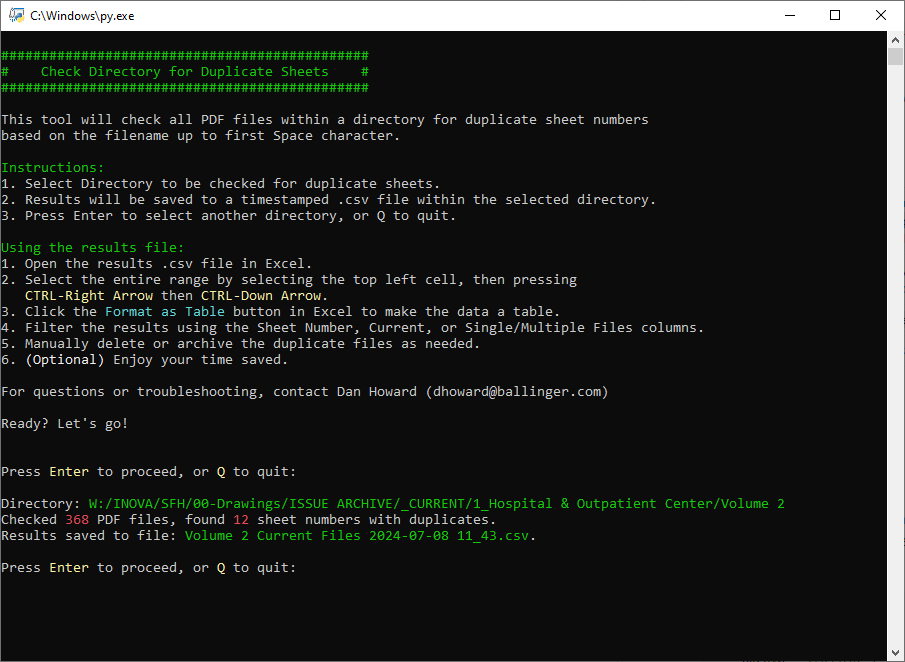

# Check Directory for Duplicate Sheet Numbers

This tool will check all PDF files within a directory for duplicate sheet numbers
based on the filename up to first Space character. 



### Terminal text coloring
Based on this Stack Overflow thread and comments: https://stackoverflow.com/questions/287871/how-do-i-print-colored-text-to-the-terminal
Note: to make the colors work in Windows CMD, do this: (from comments)

```
import os
os.system('colors')
```

